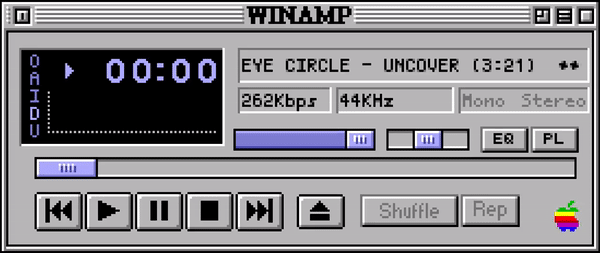

  
  

 

### [drift.rip/Xealom](https://drift.rip/Xealom)

 

  

 
 

  
<b>Projects</b>

   

  

    <b>MTG Deck Manager</b> — A minimal Linux TUI for organizing Magic: The Gathering decks with a lightweight LLM agent harness. Built around local-first workflows, terminal-based card browsing and Kitty image rendering.
    
in progress

     
  

  

    <b>AgentWorkspace</b> — A local-first desktop workspace for AI-assisted development, built with Tauri, React and TypeScript. Focused on agent workflows, persistent local state and an extensible desktop UI.
    
in progress

     
  

  

    <b>Dreamworlds</b> — A dark, dreamlike 3D platformer built in Godot, combining procedurally generated vertical worlds, biome-based exploration and action-focused combat inspired by Hollow Knight and Little Nightmares.
    
in progress

     
  

  

    <b>Minecraft Modpack Projects</b> — A collection of Minecraft modpack projects including Paleon and a NeoForge RPG pack, focused on performance, world generation, shaders, progression and custom mod configurations.
    
in progress

     
  

  

    <b>Personal Dashboard Portfolio</b> — A component-driven personal portfolio designed as an interactive dashboard, combining a custom tech-stack overview with live activity, project information and dynamic widgets.
    
in progress

     
  

  

    <b>Neural Network in Python</b> — A lightweight neural network for 3D object classification, identifying pyramids and noise from vertex data using Python and NumPy.
    
finished

     
  

  

    <b>2.5D Soulslike Game Demo</b> — A completed 2.5D action-RPG prototype developed in Unreal Engine 5, featuring Soulslike-inspired combat and a fully playable demo.
    
finished

     
  

